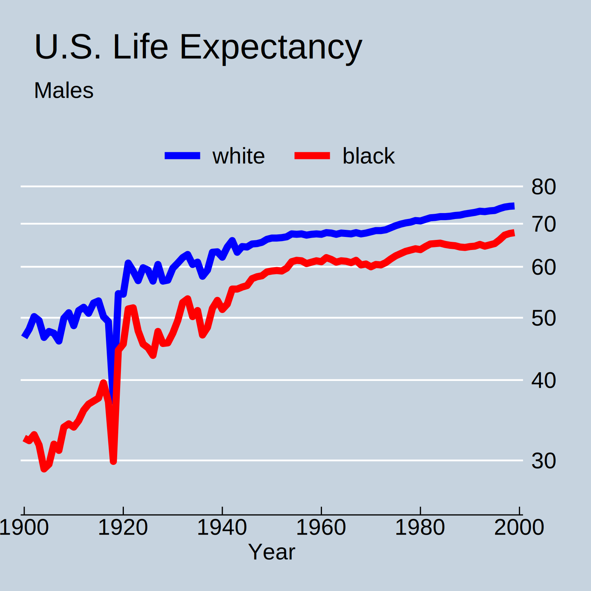

{}
Graphs are a powerful tool for exploring, summarising, and presenting data. They are an intuitive and engaging medium for policy researchers to present their results. Stata provides a powerful set of tools for graphing data and for saving graphs that may be embedded in written work or presentations.

We first show how to plot two variables against each other or to plot a variable over time using the <code><u>two</u>way</code> command. Then we show how to format `twoway` graphs by adding labels, titles, and legends. We also explore other plot types which can be used to describe data (bar plots, box plots, histograms, and density plots). 
{}

## 4.1 Two-way Plots {#s41}

### 4.1.1 Scatter Plots

Scatter plots show the relationship between two variables. They can be thought of as the visual representation of a regression (which we will discuss in more detail in section 5.2). In Stata, we create scatter plots using the `twoway` command and `scatter` plot type. 

The basic syntax of a scatterplot in Stata is `twoway scatter yvar xvar`. Notice that the vertical axis (y) variable is specified before the horizontal axis (x) variable. If we are plotting two variables where one is thought to influence the other, we tend to place the dependent variable (being influenced) on the *y-axis* and independent variable (doing the influencing) on the *x-axis*.

**Practical Exercise: Producing a simple scatter plot.**

To produce a simple scatterplot which shows how life expectancy changes with log GNP per capita by country.

```stata
. sysuse lifeexp, clear
(Life expectancy, 1998)

. gen log_gnppc = log(gnppc)
(5 missing values generated)

. twoway scatter lexp log_gnppc

```

To plot the line of best fit between two variables, use the `lfit` plot type in Stata (there is also a `qfit` plot for quadratic fits). `lfit` calculates the prediction of the dependent variable, from a linear regression of the dependent variable on the independent variable and plots the resulting line. This can be superimposed on the scatter plot by enclosing each sub-plot in parenthesis. You can think of the `twoway` command as drawing the x-axis and y-axis and then adding each `(plottype yvar xvar)` plot onto this axis sequentially.

**Practical Exercise: Adding a line of best fit to a scatter plot.**

To produce a simple scatterplot of log GNP per capita and life expectancy by country.

```stata
. twoway (scatter lexp log_gnppc) (lfit lexp log_gnppc)
``` 

Confidence bands around a fitted line depict the upper and lower bounds between which there is a 95% chance that our fitted line lies. A wider confidence band hence means a more uncertain relationship between the dependent and independent variables. The default is to plot the 95% confidence interval but higher/lower confidence intervals can be specified using the `, level()` option. Because the grey confidence band can obscure some points, we plot the confidence band first and the scatter plot later.

**Practical Exercise: Adding confidence bands to a line of best fit.**

```stata
. twoway (lfitci lexp log_gnppc, level(95)) ///
	(scatter lexp log_gnppc) ///
	, xtitle("Log GNP per capita") ///
	ytitle("Life expectancy") ///
	scheme(s1color)

``` 


Three forward slashes “///” in a do file are called continuation lines and tell Stata that a command continues along the next line. Continuation lines improve the readability of long commands and are especially useful when we start adding more options to our graphs.

### 4.1.2 Line Plots

Line plots are also created using the `twoway` command and specifying the `line` plot type. Let us use another system dataset on U.S. life expectancy between 1900-1999 to illustrate this. The line plot allows you to specify more than one *y-axis* variable. In our example we specify two, corresponding to white and black life expectancy of males. Alternatively, we could use two separate line plots: `(line le_wmale year) (line le_bmale year)`. 

**Practical Exercise: Producing a simple line plot.**

To produce a line graph of life expectancy for white and black males over the 20th century.

```stata
. sysuse uslifeexp, clear
(U.S. life expectancy, 1900-1999)

twoway line le_wmale le_bmale year ///
     , ytitle(US Life Expectancy) scheme(s1color)

``` 


### 4.1.3 Titles, Labels, Legends, and More

The graphs above look good but are missing some key information for the reader. What is being shown on the *x-axis*?  Which country is the outlier in the scatter plot? This is where titles, labels, legends, scale, notes, and text come in.

The main option used when labelling scatter plot points is `, mlabel(var)` which labels points with the value of the variable specified. Other options can be explored in `help marker_options`. 

**Practical Exercise: Labelling points in a scatter plot.**

To add country names to the points in our scatterplot.

```stata
. sysuse lifeexp, clear
(Life expectancy, 1998)

. gen log_gnppc = log(gnppc)
(5 missing values generated)

. twoway (lfitci lexp log_gnppc, level(95)) ///
 (scatter lexp log_gnppc, mlabel(country))

``` 

Plotting this graph, you will see that there are many overlapping labels which could confuse readers. One way to fix this is to decrease the size of the labels using the `mlabsize(tiny/vsmall/small)` option. Alternatively, we can include labels for only a subset of key countries. The easiest way to do this is to draw a new identical scatter plot using the conditional `if` to only include the points we want to label and add labels to this plot. The colour of scatter points is defined using `mcolor()` and labels using `mlabcolor()`, more on aesthetics in section 4.1.4.


**Practical Exercise: Labelling only certain points.**

To label only the country Haiti in our scatterplot:

```stata
. graph twoway (lfitci lexp log_gnppc) ///
 (scatter lexp log_gnppc, msize(small) mcolor(black)) ///
 (scatter lexp log_gnppc if country == "Haiti", msize(small) mcolor(black) mlabel(country) mlabsize(small) mlabcolor(black))

``` 

Stata graphs can have a `title()`, `subtitle()`, `ytitle()`, and `xtitle()`. See help `title_options` for more details. Remember to wrap the title text in quotation marks. To include text at the bottom of the graph, use the `note()` option. Or for text on the graph itself at the point (x, y) use the option `text(y x “text”)`.

The `legend` option has many sub options, see `help legend_option` to learn more. The easiest way to tell Stata which legend key you are referring to when modifying the legend is by using the `order` option, which gives each legend key a value according to the order in which it appears in the default graph. To omit a key simply leave it out of the list. 

**Practical Exercise: Adding titles, notes, texts and modifying the legend.**

Adding titles, notes, text, and modifying the legend of our scatterplot, the graph command becomes:


```stata
. graph twoway (lfitci lexp log_gnppc) ///
 (scatter lexp log_gnppc ///
     , msize(small) mcolor(black)) ///
 (scatter lexp log_gnppc if country == "Haiti" ///
     , msize(small) mcolor(black) mlabel(country) mlabsize(small) mlabcolor(black)) ///
     , title("Log GNP per capita and life expectancy, 1998") ///
       xtitle("Log GNP per capita") ///
       ytitle("Life expectancy") ///
       legend(order(2 "linear fit" 1 "95% CI")) ///
       note(Source: Stata system life expectancy dataset.) ///
	text(80 10.8 "Fitted Line", size(vsmall))

```

We might want to plot also plot life expectancy on a log scale. `xscale()` and `yscale()` control the scaling of the axes and let you choose `arithmetic`, `log`, or `reversed` scales. There is also a sub option `range()` to control the plotting range. More sub-options are available in `help axis_scale_options`. Other options control the placing and labelling of major and minor ticks and labels, such as `xlabel()`, `xtick()` and `xmtick()`, and similarly for the y-axis, see `help axis_label_options`.

**Practical Exercise: Changing the axis scale.**

To specify the life expectancy range as 50 to 80 on a logarithmic scale in our scatterplot:

```stata
. graph twoway (lfitci lexp log_gnppc) ///
  (scatter lexp log_gnppc ///
      , msize(small) mcolor(black)) ///
  (scatter lexp log_gnppc if country == "Haiti" ///
      , msize(small) mcolor(black) mlabel(country) mlabsize(small) mlabcolor(black)) ///
      , title("Life expectancy in 1998 vs log GNP per capita") ///
        xtitle("Log GNP per capita") ///
        ytitle("Life expectancy") ///
        legend(order(2 "linear fit" 1 "95% CI")) ///
        note(Source: Stata system life expectancy dataset.) ///
         text(80 10.8 "Fitted Line", size(small)) ///
        yscale(log range(50 80)) ///
        scheme(s1color)

```


### 4.1.4 Colour and Style

Presentation and aesthetics matter. Stata enables you the flexibility to tailor the formatting and look of your graphs. 

To modify the line style in a line plot, the `clstyle()` option lets you use inbuilt Stata styles, like `foreground`, `grid`, `yxline`. See `help linestyle` for more. Alternatively, you can specify the three components of a line style: the pattern, width, and colour:

- Patterns are specified using the `clpattern()` option. The most common patterns are `solid`, `dash`, and `dot`.
- Line width is specified using `clwidth()`; the available options include `thin`, `medium` and `thick`.
- Colours can be specified using the `clcolor()` option using color names (such as red, white and blue, teal, sienna, and many others). See `help colorstyle` for the full list.

**Practical Exercise: Specifying the line colour of a line plot.**

To specify blue for white males and red for black males in our line plot, we use the following command:

```stata
. twoway (line le_wmale le_bmale year, clcolor(blue red)) ///
    , title("U.S. Life Expectancy") subtitle("Males") ///
      legend(order(1 "white" 2 "black"))
```

Stata uses schemes to control the appearance of graphs, see `help scheme`. Try `stgcolor` for the scheme used in the Stata manuals, `sj` for the scheme used in the Stata journal, and `economist` for the style used by The Economist. 

**Practical Exercise: Using a Stata graph scheme.***

Line plot of white and black male life expectancy over the 20th century in the style of The Economist.

```stata
. twoway line le_wmale le_bmale year, clcolor(blue red) ///
    , title("U.S. Life Expectancy") subtitle("Males") ///
      legend(order(1 "white" 2 "black")) ///
      yscale(log range(25 80)) ///
	scheme(economist)
```



## 4.2 Other Graphs {#s42}

### 4.2.1 Bar Graphs

Bar graphs are useful when we want to display categorical data, or to plot descriptive statistics of a continuous variable within groups defined by a categorical variable. To explore how to create bar graphs in Stata using the <code><u>gr</u>aph bar</code> command, we use the system dataset on city temperatures in different regions. 

**Practical Exercise: Creating a simple bar graph.**

A simple bar chart of the frequency distribution of the region variable can be obtained from the following commands.

```stata
. sysuse citytemp, clear 
(City temperature data)

. graph bar, over(region)

```

To add the average temperature in January and July specify `(mean) tempjan (mean) tempjuly`. As in the frequency tables described in section 3.5, instead of the mean we could have specified any of `mean median p1 p2 ... p99 sum count percent min max`.
 
Using the over() option overlays the two bars in the same graph. Using the by() option would instead produce a separate graph for each region. The bargap() option controls the size of the gap between bars.

**Practical Exercise: Bar graph with mean of a continuous variable.**

```stata
. graph bar (mean) tempjan (mean) tempjul, over(region) ///
      bargap(10) title(Mean Temperature) legend(order(1 “January” 2 “July”)) ///
      scheme(s1color) bar(1, color(dkgreen)) bar(2, color(navy))

```


### 4.2.2 Box Plots

From the bar chart above, we can see that the northern regions (north-east and north-central) are much colder in January than the southern regions. We might also be interested in the distribution of temperatures in January within these two regions. A quick summary of the distribution of a variable may be obtained using a “box-and-whiskers” plot, created using the the <code><u>gr</u>aph box</code> command. This draws a box ranging from the first to the third quartile, with a line at the median, and adds “whiskers” going out from the box to the minimum and maximum values, excluding values identified as potential outliers which are shown as circles (more than 1.5 times the interquartile range from the median).

**Practical Exercise: Creating a box plot.**

To draw the box plot for January temperatures in northern regions (regions coded 1 and 2), use the `graph box` command.

```stata
. sysuse citytemp, clear 
(City temperature data)

.  graph box tempjan if region == 1 | region == 2 ///
, over(region) title(Box Plots of January Temperature by Region) scheme(s1color)

```


We see that temperatures are lower and more variable in north-central regions, where quite a few cities have unusually cold average temperatures.

### 4.2.3 Histograms and Kernel Density Plots

For a more detailed view of the distribution of a single variable, we can create a histogram using the <code><u>hist</u>ogram</code> command. For example, using the system life expectancy data, the command for a histogram of life expectancy would be `histogram lexp`. The kernel density smoother fits a smooth line over this histogram. Kernel density plots can be obtained using the `kdensity` command. Use the `twoway` command to overlay the kernel density plot and histogram.

**Practical Exercise: Overlay a histogram and Kernel-density plot.**

```stata
. sysuse lifeexp, clear
(Life expectancy, 1998)

. twoway (hist lexp) /// 
         (kdensity lexp) ///
         , title("Distribution of Life Expectancy, 1998") ///
         ytitle("Density") ///
         xtitle("Life Expectancy") ///
         scheme(s1color)
```


We often assume that a variable is approximately distributed with a normal distribution. Kdesnity plots are a good way to assess the validity of this assumption. Use the `, normal` option to add a normal distribution to our kernel density plot of life expectancy for comparison.

**Practical Exercise: Overlay a normal and Kernel-density plot.**

```stata
. kdensity lexp, normal ///
         title("Distribution of Life Expectancy, 1998") ///
         ytitle("Density") ///
         xtitle("Life Expectancy") ///
         scheme(s1color)

```


## 4.3 Managing Graphs {#s43}

We can save any graph we produce as a Stata .gph graph using the <code><u>gr</u>aph <u>sa</u>ve filename</code> command, specifying the `, replace` option if we want to replace the existing filename. To load graphs into Stata the command is <code><u>gr</u>aph <u>u</u>se filename</code>. 

To incorporate graphs into a document or presentation, we will want to save them in a more useable format (like .png or .pdf). To do this we can either navigate through the menus in the graph window: “File -> Save as”. We can also use the command <code><u>gr</u>aph export filename.png, replace</code>.


