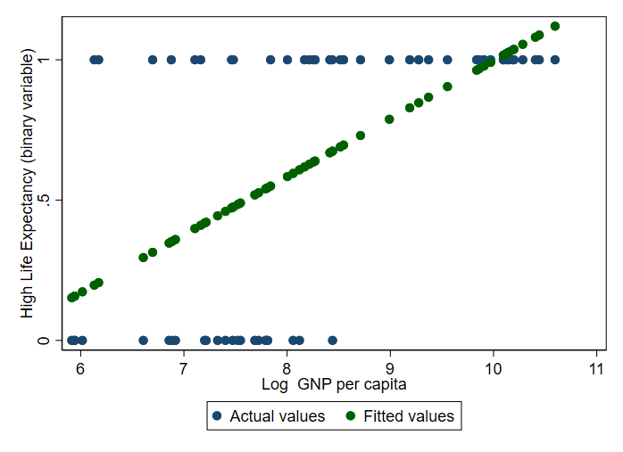

Regressions are one of the most powerful data analysis tools. One of the great advantages of Stata is the ease and flexibility with which you can estimate regressions. This section provides an introduction to regression analysis using Stata.

## 5.1 Correlation Tables and T-tests {#s51}

An initial step in assessing the relationship between variables is to create a correlation table using the <code><u>corr</u>elate</code> command followed by the variables you want to correlate. 

**Practical Exercise: Correlation table of variables.**

Using the life expectancy data we see that GNP per capita and life expectancy have a positive correlation coefficient of around 0.7.

```
. sysuse lifeexp, clear
(Life expectancy, 1998)

. corr lexp gnppc
(obs=63)

        |     lexp    gnppc
──────────────────────────
   lexp |   1.0000
  gnppc |   0.7182   1.0000

```

In policy research, you often only collect data of a small random sample of the whole population. The population will have one true mean value, but each random sample will have slightly different sets of values with slightly different means. If you take enough samples from a population, the means will be arranged into a distribution around the true population mean. This is called the sampling distribution.

We can ask how likely it is that the population mean takes on a certain value given our sample mean using the `ttest` command.

In the example below, we test the hypothesis that the population mean life expectancy is equal to 70 using our life expectancy sub-sample. The main numbers of interest in this t-test output table are the p-values (last row). The one-tailed p-values evaluate the null against the alternatives that the mean is less than 70 (left test) and greater than 70 (right test). If p-value is less than the pre-specified confidence level (usually .05 or .01) we conclude that mean is statistically significantly greater or less than the null hypothetical value. In this case, we conclude that the mean is significantly greater than 70.

The two-tailed t-test in the bottom centre evaluates the null against an alternative that the mean is not equal to 50. Since the p-value is less than 0.05, we conclude that the mean life expectancy is statistically significantly different from 70.

**Practical Exercise: Run a mean comparison t-test.**

Suppose we want to know whether the population mean of life expectancy is significantly different from 70. We can test the null hypothesis that the mean is equal to 70 using the following command:

```
. ttest lexp == 70

One-sample t test
------------------------------------------------------------------------------
Variable |     Obs        Mean    Std. err.   Std. dev.   [95% conf. interval]
---------+--------------------------------------------------------------------
    lexp |      68    72.27941    .5718159    4.715315    71.13806    73.42076
------------------------------------------------------------------------------
    mean = mean(lexp)                                             t =   3.9863
H0: mean = 70                                    Degrees of freedom =       67

    Ha: mean < 70               Ha: mean != 70                 Ha: mean > 70
 Pr(T < t) = 0.9999         Pr(|T| > |t|) = 0.0002          Pr(T > t) = 0.0001
```


## 5.2 Linear Regression {#s52}

We can use a linear regression to further investigate the relationship between life expectancy and income. The command used for linear regressions is <code><u>reg</u>ress</code>. The command takes the form `regress y x1 x2 x3 … xn`, where `y` is our dependent variable and `x1 … xn` are our covariates (all of the independent variables which are thought to influence `y`). Stata automatically includes a constant term, the variable `_cons`, so you do not need to create a constant term yourself. 

**Practical Exercise: Run a linear regression.**

```
. sysuse lifeexp, clear
(Life expectancy, 1998)

. gen log_gnppc = log(gnppc)
(5 missing values generated)

. regress lexp log_gnppc popgrowth safewater

      Source |       SS           df       MS      Number of obs   =        37
-------------+----------------------------------   F(3, 33)        =     33.30
       Model |  722.137692         3  240.712564   Prob > F        =    0.0000
    Residual |   238.56501        33  7.22924274   R-squared       =    0.7517
-------------+----------------------------------   Adj R-squared   =    0.7291
       Total |  960.702703        36  26.6861862   Root MSE        =    2.6887

------------------------------------------------------------------------------
        lexp | Coefficient  Std. err.      t    P>|t|     [95% conf. interval]
-------------+----------------------------------------------------------------
   log_gnppc |   1.493245    .551269     2.71   0.011     .3716798     2.61481
   popgrowth |  -.5310035   .5548132    -0.96   0.345    -1.659779    .5977725
   safewater |   .1385733   .0394751     3.51   0.001     .0582607    .2188859
       _cons |    49.6063   3.547374    13.98   0.000     42.38911    56.82348
------------------------------------------------------------------------------
```

### 5.2.1 Interpreting Regression Output Tables

The output will be presented as in the regression tables shown above. Interpreting these tables may seem confusing at first but will soon become second nature.

The most important of these numbers are the coefficient estimates (2nd column). The coefficients tell us the effect of each x variable listed in the 1st column on life expectancy. When neither of the variables are in log form the interpretation is straightforward: the coefficient tells us how life expectancy changes if the x variable changes by one unit. Since GNP per capita is in logs, the interpretation is that a 1% increase in GNP per capita is associated with an increase of 0.0277 years in life expectancy (noting that if GNP increases by one percent its log increases by 0.01). Conversely, if the y variable is in log form and x is not, then the x coefficient tells you the percentage change in y when x goes up by one unit. If both variables are in logs, then the x coefficient tells you the percentage change in y when x goes up by 1% (i.e., the elasticity of y with respect to x).

The standard error of the coefficient (3rd column) measures how precisely the model estimates the coefficient's unknown value. When we think that the errors do not have uniform variance (i.e., heteroskedastic errors) we must use robust standard errors by adding the robust option to our regression, e.g., `regress lexp log_gnppc, robust`.

The t-statistic (4th column) is equal to the coefficient estimate over its standard error. As we know the distribution of the t statistic, we are able to assess the probability that the population coefficient is equal to zero. This probability is the p-value displayed in the 5th column. In the last regression, we see that this probability is greater than 0.05 for the coefficient on population growth. So, we fail to reject the null hypothesis that the coefficient on population growth is equal to 0. More succinctly, the effect of population growth on life expectancy is statistically insignificant at the 5% level.

### 5.2.2 Dummy Variables

Suppose we also want to include the region variable in our regression. It would be incorrect to run the model `regress lexp log_gnppc popgrowth safewater region` as `region` is not a continuous variable. Instead, we want to include a separate regression intercept for each region. The easiest way to do this in Stata is include `i.` before the categorical variable you wish to include.

In the practical example below which adds region dummies to our life expectancy regression, notice that there are only two dummies even though there are three regions. Each dummy coefficient tells us the effect of each region on life expectancy relative to the base region (in our case Europe and Central Asia). So, North and South America have lower life expectancy than Europe and Central Asia, although the difference is not statistically significant.

We can choose which region to use as a base. To specify North America (coded as 2) as the base, use the following command: `regress lexp log_gnppc popgrowth safewater b2.region`.

**Practical Exercise: Run a linear regression with dummy variables.**

```
. regress lexp log_gnppc popgrowth safewater i.region

      Source |       SS           df       MS      Number of obs   =        37
-------------+----------------------------------   F(5, 31)        =     18.95
       Model |  723.836248         5   144.76725   Prob > F        =    0.0000
    Residual |  236.866455        31  7.64085337   R-squared       =    0.7534
-------------+----------------------------------   Adj R-squared   =    0.7137
       Total |  960.702703        36  26.6861862   Root MSE        =    2.7642

--------------------------------------------------------------------------------
          lexp | Coefficient  Std. err.      t    P>|t|     [95% conf. interval]
---------------+----------------------------------------------------------------
     log_gnppc |   1.586536   .6088676     2.61   0.014     .3447419    2.828329
     popgrowth |  -.2782813   .7849757    -0.35   0.725     -1.87925    1.322687
     safewater |   .1335213   .0423067     3.16   0.004     .0472362    .2198064
               |
        region |
North America  |   -.612925   1.400706    -0.44   0.665    -3.469683    2.243833
South America  |  -.6228757   1.497229    -0.42   0.680    -3.676495    2.430743
               |
         _cons |   49.23628   3.759722    13.10   0.000     41.56827    56.90428
--------------------------------------------------------------------------------
```

### 5.2.3 Interaction Effects

We can have interaction effects between two continuous variables, a continuous and a categorical variable, or two categorical variables.
 
Starting with two continuous variables, suppose we think the effect of safe drinking water on life expectancy is not linear. We can examine this by including the square of the `safewater` variable in the regression. One way to do this would be to generate a new variable (see section 3.6) and include it in the regression. Alternatively, we can include the interaction term using `#`. Remember to add a `c.` before `safewater` to tell Stata that it is dealing with a continuous variable. 

**Practical Exercise: Interact continuous variables.**

```
. regress lexp log_gnppc safewater c.safewater#c.safewater

      Source |       SS           df       MS      Number of obs   =        37
-------------+----------------------------------   F(3, 33)        =     37.04
       Model |  740.746457         3  246.915486   Prob > F        =    0.0000
    Residual |  219.956246        33  6.66534078   R-squared       =    0.7710
-------------+----------------------------------   Adj R-squared   =    0.7502
       Total |  960.702703        36  26.6861862   Root MSE        =    2.5817

----------------------------------------------------------------------------------------
                   lexp | Coefficient  Std. err.      t    P>|t|     [95% conf. interval]
------------------------+---------------------------------------------------------------
              log_gnppc |   2.212724   .5762273     3.84   0.001      1.04038    3.385067
              safewater |   .4402642   .1591055     2.77   0.009     .1165615    .7639668
                        |
c.safewater#c.safewater |   -.002323    .001194    -1.95   0.060    -.0047522    .0001062
                        |
                  _cons |   34.25524   7.264115     4.72   0.000     19.47629     49.0342
----------------------------------------------------------------------------------------
```

The coefficient estimate on the square of `safewater` is negative. This means that the effect is decreasing in safe water access (for countries with higher access to safe water, the marginal gains from improving safe water access are smaller).

We might also think that the effect of safe drinking water on life expectancy varies by region. To test this, interact the `safewater` variable with our regional dummies using the `#`. Specify whether variables are continuous (`c.`) or categorical (`i.`).

**Practical Exercise: Interact continuous variables with categorical variables.**

```
. regress lexp log_gnppc popgrowth safewater i.region#c.safewater

      Source |       SS           df       MS      Number of obs   =        37
-------------+----------------------------------   F(5, 31)        =     18.94
       Model |  723.770406         5  144.754081   Prob > F        =    0.0000
    Residual |  236.932296        31   7.6429773   R-squared       =    0.7534
-------------+----------------------------------   Adj R-squared   =    0.7136
       Total |  960.702703        36  26.6861862   Root MSE        =    2.7646

------------------------------------------------------------------------------------
              lexp | Coefficient  Std. err.      t    P>|t|     [95% conf. interval]
-------------------+----------------------------------------------------------------
         log_gnppc |   1.523157    .580035     2.63   0.013     .3401674    2.706146
         popgrowth |  -.5400662   .7261172    -0.74   0.463    -2.020992    .9408597
         safewater |   .1362441   .0409431     3.33   0.002     .0527401    .2197482
                   |
region#c.safewater |
    North America  |    .004114   .0172491     0.24   0.813    -.0310659    .0392938
    South America  |   -.003567   .0180154    -0.20   0.844    -.0403096    .0331756
                   |
             _cons |   49.53485   3.779901    13.10   0.000     41.82569    57.24401
------------------------------------------------------------------------------------
```

The two variables tell us that the effect safe water access on life expectancy does not vary significantly by region (since the p-values are greater than 0.05).

Interacting two categorical variables is done in the same way (`i.catvar#i.catvar`). If you want to include the dummy variables separately as well as the interaction, a shortcut in Stata is to use the double `##`. This includes the full expansion of the variables being interacted in the regression. 

## 5.3 Hypothesis Testing {#s53}

We have already established the meaning of the t statistics and p-values in the regression output tables, these refer to a test of the null hypothesis that the coefficient on that variable in the population is equal to zero. However, we can also test any linear hypothesis using the <code><u>te</u>st</code> command. For example, if we wanted to test whether the log GNP per capita effect is significantly different to 1, we would run the command below.

**Practical Exercise: Hypothesis test.**

```
. quiet regress lexp log_gnppc popgrowth safewater

. test _b[log_gnppc] == 1

 ( 1)  log_gnppc = 1

       F(  1,    33) =    0.80
            Prob > F =    0.3774
```

Here I use <code><u>qui</u>et</code> to suppress the regression output, which is useful when we are only interested in the hypothesis test results.  As the p-value is greater than 0.05, we fail to reject the null hypothesis that the coefficient on income is equal to 1. We can also hypothesis test linear combinations of coefficients: `test _b[log_gnppc] - _b[safewater] == 0`. To test non-linear combinations, use the testnl command. For joint hypothesise, include test in separate brackets: `test (_b[log_gnppc] == 0) (_b[safewater] == 0)`.

## 5.4 Binary Regressions {#s54}

We have explored how to deal with categorical variables on the right-hand side of our regressions. Now let us see how to deal with categorical outcome variables using a probit (or logit) regression in Stata. To illustrate this, let us generate a categorical variable equal to 1 if a country’s life expectancy is greater than 70 and zero otherwise.

```
. quiet reg high_lexp log_gnppc

. predict high_lexp_prediction
(option xb assumed; fitted values)
(5 missing values generated)
```

The reason we can’t run a simple linear regression in that the outcome variable can only take on the values of 0 or 1, but a linear regression would generate a continuous prediction which could be lower than 0 or greater than 1. To examine this graphically, use the `predict` command which stores the predicted values of a regression (see `help predict` for more detail), and plot these predicted values against our binary outcome.

	quiet reg high_lexp log_gnppc
	predict high_lexp_prediction

The issue is clear from the graph below: for countries with a log GNP per capita greater than 10, the predicted value is greater than 1.

```
. twoway (scatter high_lexp log_gnppc, mcolor(navy)) ///
    (scatter high_lexp_prediction log_gnppc, mcolor(dkgreen)) ///
    , xtitle("Log  GNP per capita") ///
    ytitle("High Life Expectancy (binary variable)") ///
    legend(order(1 "Actual values" 2 "Fitted values")) ///
    scheme(s1color)
```


Two of the most popular alternatives when dealing with binary outcome variables are the probit and logit estimators. The two estimators involve slightly different distributional assumptions but should produce roughly the same results. To run these regressions, use the `probit` (or `logit`) command.

It is important to recognise that the coefficient estimates from these regressions are not the same as the output generated by the simple linear regressions above. They are not marginal effects, i.e., they do not tell us the average effect of a unit change in the X variable on Y (dy/dx). However, we can calculate marginal effects from the probit(/logit) regression output using the `margins` command. The syntax is `margins, dydx(xvar)`. As the marginal effects differ depending on the value of the x variables, there are a number of different ways of calculating these. By default, Stata calculates these marginal effects at the mean of the independent variables, however it is also possible to evaluate them at other values by specifying the `at(var = value)` option.

**Practical Exercise: Run a probit regression and calculate the marginal effects.**

Use the probit model for the effect of log GNP per capita on the likelihood of being a “high life expectancy” country. We can summarise the predicted values to verify that they lie between 0 and 1.

```
. probit high_lexp log_gnppc

Iteration 0:   log likelihood = -41.345943  
Iteration 1:   log likelihood = -28.858118  
Iteration 2:   log likelihood = -28.512014  
Iteration 3:   log likelihood = -28.511079  
Iteration 4:   log likelihood = -28.511078  

Probit regression                                       Number of obs =     63
                                                        LR chi2(1)    =  25.67
                                                        Prob > chi2   = 0.0000
Log likelihood = -28.511078                             Pseudo R2     = 0.3104

------------------------------------------------------------------------------
   high_lexp | Coefficient  Std. err.      z    P>|z|     [95% conf. interval]
-------------+----------------------------------------------------------------
   log_gnppc |   .7923054   .1956773     4.05   0.000     .4087849    1.175826
       _cons |  -5.951921   1.519856    -3.92   0.000    -8.930783   -2.973058
------------------------------------------------------------------------------

. predict high_lexp_probit
(option pr assumed; Pr(high_lexp))
(5 missing values generated)

. sum high_lexp_probit

    Variable |        Obs        Mean    Std. dev.       Min        Max
-------------+---------------------------------------------------------
high_lexp_~t |         63    .6432734    .2870433   .1026455   .9927263

. margins, dydx(log_gnppc)

Average marginal effects                                    Number of obs = 63
Model VCE: OIM

Expression: Pr(high_lexp), predict()
dy/dx wrt:  log_gnppc

------------------------------------------------------------------------------
             |            Delta-method
             |      dy/dx   std. err.      z    P>|z|     [95% conf. interval]
-------------+----------------------------------------------------------------
   log_gnppc |   .1994692   .0241786     8.25   0.000     .1520799    .2468585
------------------------------------------------------------------------------
```

## 5.5 Instrumental Variable Regression {#s55}

An ordinary least squares (OLS) regression can lead to biased estimates if there is correlation between the independent (X) variable and the error term in the model. This can arise under a number of scenarios, including omitted variables, simultaneity and measurement error.

One common example is the effect of schooling on wages. Higher education usually correlates with higher wages. However, individuals with higher schooling may also have more motivation, which also correlates with higher wages. If we were to regress wages on education without controlling for the effect of unobservable motivation, we could overestimate the positive effect of schooling, because we would be also capturing the hidden motivation effect.
 
This problem of omitted variable bias can be fixed by using an instrumental variable (IV) which is correlated with the X variable (in our case education) but not any of the other predictors of Y (like motivation or ability which may affect wages). This isolates the exogenous part of X, which we can use to examine the true causal effect of X on Y. In the case of the schooling example, we can use the distance to the nearest college, since individuals who live near a college are more likely to have higher years of education but are not necessarily more motivated/able than students who live far from a college.

To estimate at instrumental variable regression in Stata, we can use the <code><u>ivreg</u>ress</code> command, which uses the syntax: `ivregress yvar xvar (endogenous variable(s) = IV(s))`. To illustrate this, load US data on individual-level education (`educ`), distance to college (`nearc4`), labour market experience (`exper`), and wages (`lwage`). 

**Practical Exercise: Estimate an instrumental variable regression.**

```
. use http://fmwww.bc.edu/ec-p/data/wooldridge/card, clear

. ivreg lwage (educ = nearc4) exper

Instrumental variables 2SLS regression

      Source |       SS           df       MS      Number of obs   =     3,010
-------------+----------------------------------   F(2, 3007)      =     29.01
       Model | -245.292502         2 -122.646251   Prob > F        =    0.0000
    Residual |  837.934114     3,007  .278661162   R-squared       =         .
-------------+----------------------------------   Adj R-squared   =         .
       Total |  592.641611     3,009  .196956335   Root MSE        =    .52788

------------------------------------------------------------------------------
       lwage | Coefficient  Std. err.      t    P>|t|     [95% conf. interval]
-------------+----------------------------------------------------------------
        educ |   .2620434   .0344996     7.60   0.000     .1943982    .3296886
       exper |   .1119277   .0147441     7.59   0.000     .0830182    .1408373
       _cons |   1.794982   .5869679     3.06   0.002     .6440832    2.945882
------------------------------------------------------------------------------
Instrumented: educ
 Instruments: exper nearc4
```

## 5.6 Exporting Regression Tables {#s56}

You can save estimates from regressions using the <code><u>est</u>imates <u>sto</u>re</code> command. To then present multiple estimates in the same table in Stata, use `esttab`. There are several options to add information to the `esttab` table of estimate, see `help esttab`. Usually, we want to at least include the adjusted R-squared value by specifying the `ar2` option. You can suppress the constant term by specifying the `nocons` option.

`esttab` output can be displayed on your results screen but can also be exported in various formats, including HTML, Word documents, Excel documents, LaTeX, or PDF. To export an esttab table to a word document use: `esttab estimates using "tablename.doc", replace`. We can also export estimates to Latex or pdf by specifying a “.tex” or “.pdf” files, e.g., `esttab estimates using "tablename.tex", replace`.

**Practical Exercise: Exporting a regression output table.**

```
. quiet reg lexp log_gnppc popgrowth safewater

. est store regression1

. quiet reg lexp log_gnppc popgrowth safewater i.region c.safewater#c.safewater

. est store regression2

. esttab regression1 regression2, ar2 nocons

--------------------------------------------
                      (1)             (2)   
                     lexp            lexp   
--------------------------------------------
log_gnppc           1.493*          2.418** 
                   (2.71)          (3.56)   
popgrowth          -0.531         -0.0124   
                  (-0.96)         (-0.02)   
safewater           0.139**         0.500** 
                   (3.51)          (3.01)   
2.region                           -1.134   
                                  (-0.85)   
3.region                           -1.756   
                                  (-1.18)   
c.safewate~r                     -0.00290*  
                                  (-2.27)   
--------------------------------------------
N                      37              37   
adj. R-sq           0.729           0.748   
--------------------------------------------
t statistics in parentheses
* p<0.05, ** p<0.01, *** p<0.001

. esttab regression1 regression2 using "regression_table_example.doc", ar2
(output written to regression_table_example.doc)
```


