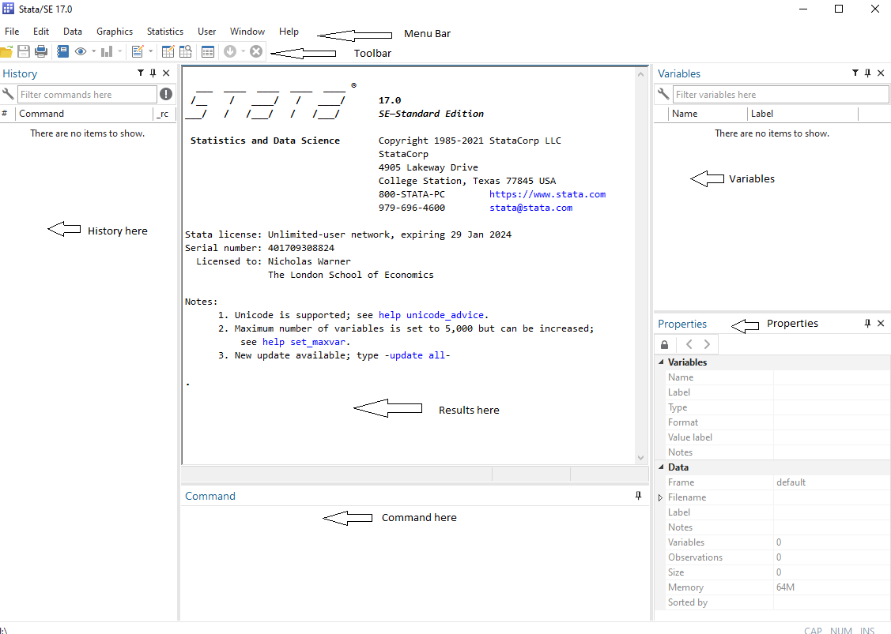
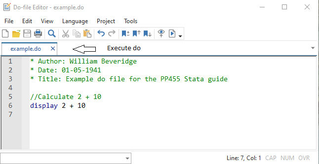

## 2.1 Downloading Stata {#s21}

You can request a license and instructions on how to download and install Stata on your laptop or home PC by emailing [tech.support@lse.ac.uk](tech.support@lse.ac.uk). The IT service desk will then email you back with the licence details and a detailed installation guide.

The version of Stata included in the LSE licence is Stata/SE, the standard edition. Different editions, Stata/BE (basic edition) and Stata/MP (multicore processor), can handle smaller/larger datasets. This guide has been written using Stata/SE version 17, but most of the discussion applies to older versions as well.

## 2.2 The Stata Interface {#s22}

When you open Stata you will see 5 sub-windows, as in the image below.



The bottom *Command* window will be your main interface with Stata. Type your commands in the Command window, and execute them with the enter key. The output of your commands is then shown in the *Results* window above. Past commands are added to the *History* window on the left. You can click on any past commands from the history tab to paste them into the command line, or select past commands using the page up and page down keys. The right-hand side windows labelled *Variables* and *Properties* show us key information about our data.

**Practical Exercise: Type a command.**

Stata can work as a calculator using the <code><u>d</u>isplay</code> command. Type the following in the command box and press the “enter” key to execute the command. This should return the following in our results window. The command should also appear in the history tab.

```
.  display 2+10 
12
```

Make sure to use a lowercase – Stata commands are case-sensitive! All commands can also be abbreviated (<code><u>d</u></code> will return the same results at <code><u>d</u>isplay</code>); Stata documentation underlines the minimum letters needed to execute a command and we will do the same in this guide.

Stata’s graphical user interface (GUI) allows selecting commands and options from the menu bar. For example, instead of typing <code><u>d</u>isplay 2+10 </code> in the command window, we could go through “Data -> Other utilities -> Hand calculator” and type <code>2+10</code> in the expression box then click “ok”. This will return exactly the same result as using the display command. Although the GUI can be helpful when you are starting to learn Stata and do not know the name of commands, it is strongly recommended to use the command language as a way to ensure reproducibility of your results, something we will cover directly in the next section.

## 2.3 Using Stata Effectively {#s23}

One of the great advantages of Stata is that it enables you to clearly document the steps in your analysis and keep track of any changes made to your data. This is done using “do files”. A do file is simply a list of commands that you wish to perform on your data. Do files are incredibly useful, to yourself and to other researchers. They allow you to identify and correct mistakes without losing progress. They also allow other researchers to understand and reproduce your analysis and are increasingly required by journals for published papers. 

We recommend that you produce a do-file for *all* assignments you are asked to run in Stata, no matter the size. 

**Practical Exercise: Open and execute a do file.**

There are a few ways of opening a do file in Stata. The easiest is to click on the notepad icon in the toolbar. Alternatively, you can go through “Window -> Do-file editor -> New do-file” or type `doedit` in the command window.

Type the same command we used above in the do file. Stata ignores lines beginning with * or //, so the asterisk and double slash can be used to write comments, which will appear in green. It is good practice to annotate your do files with explanatory comments. Every do file should also start with the name of the programmer (you!) and the date. Execute the command by clicking on the play icon below the menus. This should return exactly the same results as in the exercise above in the results window.



When working on a Stata project, we should save all our data and do files into one folder. This folder is called the “working directory”. To tell Stata where the folder is, either use the menus “File -> Change working directory” or `cd` <code>“pathtoyourfolder”</code> in the command window. The benefit of setting the working directory is that we can execute do files and save/load data without having to type out the folder path each time. 

**Practical Exercise: Setting a working directory.**
 
Create a folder to be your Stata working directory for this guide. Save your do file here and change the working directory in Stata. You can then execute the do file by simply typing <code>do dofilename</code> in the command window.

```
. cd "C:\Users\beveridgew\Projects\Stata resource"
C:\Users\beveridgew\Projects\Stata resource

. do example.do

. * Author: William Beveridge
. * Date: 01-05-1941
. * Title: Example do file for the PP455 Stata guide
. 
. //Calculate 2 + 10
. display 2 + 10
12
```

## 2.4 Getting Help {#s24}

Stata provides excellent inbuilt access to Help Files, which are descriptions of every command. These can be accessed either through “Help” in the menu bar or by typing `help` followed by the command name in the command window. 

**Practical Exercise: Open a Help file.**

To see the description of the display command, type:
```
	help display
```
The best way to understand how a command works is often by looking at examples at the bottom of the Help file. If you do not know a specific command name, you can perform a keyword search or command search through the “Help” tab in the menu bar.

Other recommended resources:

- Stata website [https://www.stata.com](https://www.stata.com/) where you can find the full official documentation.
- LSE series of Stata video tutorials: [https://www.lse.ac.uk/Methodology/Software-tutorials/Stata-tutorials](https://www.lse.ac.uk/Methodology/Software-tutorials/Stata-tutorials).
- The Statalist forum where users can post questions and receive answers from the Stata community: [https://www.statalist.org](https://www.statalist.org/).
- UCLA maintains an excellent Stata portal at [https://stats.idre.ucla.edu/stata/](https://stats.idre.ucla.edu/stata/).


