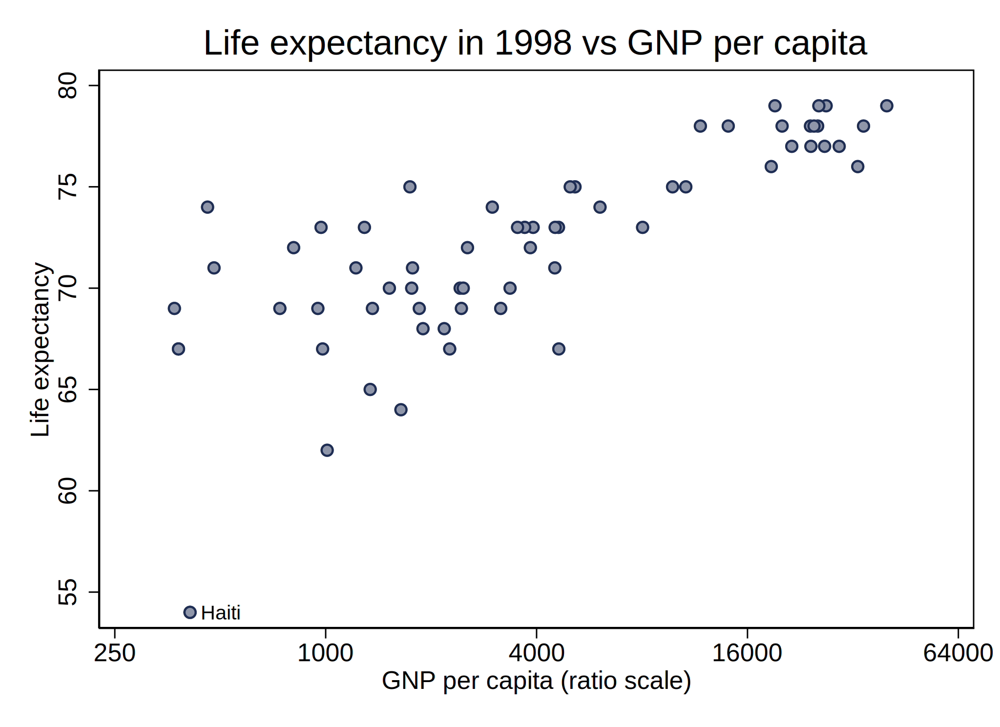

Quantitative data analysis is a cornerstone of public policy research. Stata is a general-purpose statistical software used for data manipulation, visualization, and analysis. It is powerful and easy to use. Stata is amongst the most used statistical packages by researchers and public policy practitioners. 

This guide is an introduction to Stata, suitable for an audience that has no background in using statistical software. First, we provide an overview of Stata (section 2), including how to download and open Stata, type commands, organise Stata files, and get help. We then discuss how to view and manipulate data (section 3), how to create graphs (section 4), and how to perform regression analysis in Stata (section 5). Finally, we introduce more advanced concepts including data frames, loops, and macros (section 6). 

This document is designed to accompany the PP455 course in quantitative methods for policy analysis. It is a complement rather than a substitute for the core readings, lectures, and course material. Stata commands throughout the guide will be shown using `typewriter font`.

## 1.1 The Power of Stata {#s11}

To illustrate how Stata can be employed to explore policy questions, let us consider evidence on the relationship between income and health across countries. In this example, we will analyse the relationship between a country's life expectancy and income level, measured by gross national product (GNP) per capita. This exploration can provide insights into how economic factors might correlate with health outcomes at a country level.

We can explore this relationship by loading a dataset held in Stata's system with information on life expectancy and gross national product (GNP) per capita in 1998 for 68 countries (in section 3.1 we explain how to load data in more detail). To visualise the relationship between a country's GNP per capita and life expectancy, draw a scatter plot using the `twoway` command (more on this in section 4.1). 

The plot shows a positive relationship between income per capita and life expectancy, but the relationship is not linear: life expectancy varies less with GNP per capita for richer countries. To account for this, we might want to plot GNP per capita on a ratio scale instead of a linear scale (explained in section 4.1.3). 

The relationship looks almost linear, apart from a possible outlier with a low life expectancy of 54. We can identify this country using the `list` command (described in section 3.2) to list all countries with a life expectancy under 55. The outlier in question is Haiti, as labelled on our figure (more on labelling points in section 4.1.3).

